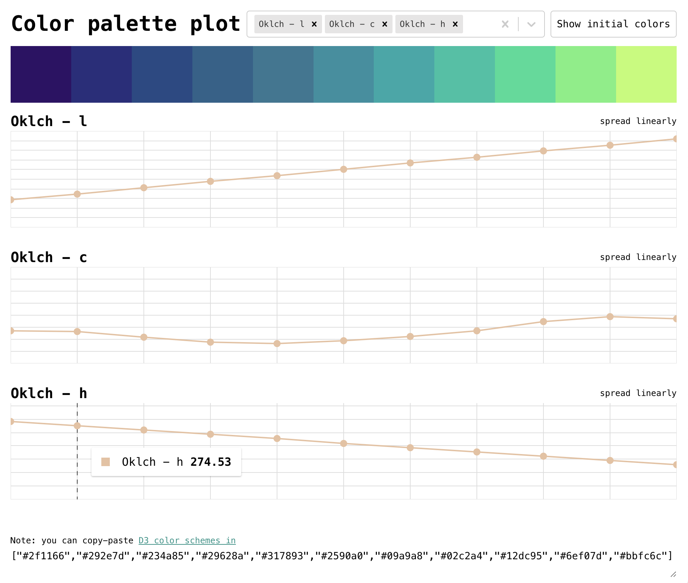

# Color Palette Plot Editor

A simple tool to create and edit color palettes in the OKLab (Oklch) color space (or any space that is supported by `colorjs`).

Is this scientific? No! Is it fun? Yes!

Copy paste JSON into the text area, and then you can adjust colours by dragging points in the plots. The JSON will be updated in real time. Currently the plots will show OKLab (Oklch) dimensions: lightness, chroma and hue.

